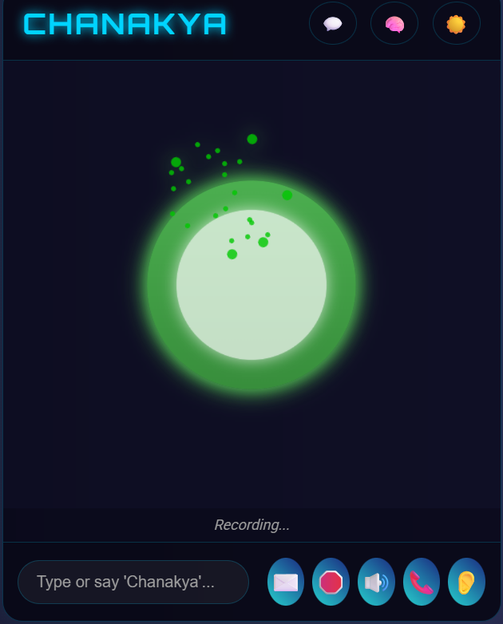

# Chanakya - Advanced Voice Assistant

**Chanakya** is an advanced, open-source, and self-hostable voice assistant designed for privacy, power, and flexibility. It leverages local AI/ML models to ensure your data stays with you.

<div align="center">    </div>

## ✨ Key Features

- **🗣️ Voice-Powered Interaction:** A voice-first user experience.
- **🔒 Privacy by Design:** Utilizes local LLMs (via Ollama), STT, and TTS to keep your data on your own hardware.
- **🛠️ Extensible Tool System:** Integrates with a wide range of external tools using the Model Context Protocol (MCP).
- **🧠 Long-Term Memory:** Remembers information from past conversations and allows you to manage its knowledge base.
- **🤖 Sophisticated ReAct Agent:** Capable of handling complex, multi-step tasks by reasoning and acting.
- **🚀 Easy to Deploy:** Comes with Docker support for quick and consistent setup.
- **🎨 Customizable UI:** A clean web interface with dark mode support.

## 🚀 Quick Start

This guide will get you up and running in a few minutes. For more detailed instructions, please refer to our full documentation.

1. **Clone the repository:**
    
    ```bash
    git clone <repository_url>
    cd chanakya-voice-assistant
    ```
2. **Set up dependencies:**
    
    - Ensure [Docker](https://www.docker.com/) and [Ollama](https://ollama.com/) are installed and running.
    - Pull the required Ollama models (e.g., `ollama pull hf.co/unsloth/Qwen3-Coder-30B-A3B-Instruct-GGUF:UD-Q4_K_XL`).
    - Run the dependent services for STT and TTS (see the [Getting Started Guide](./docs/getting-started.md) for details).
3. **Configure the application:**
    
    ```bash
    cp .env.example .env
    cp mcp_config_file.json.example mcp_config_file.json
    ```
    
    - Edit `.env` and `mcp_config_file.json` with your settings. See the [Configuration Guide](./docs/configuration.md) for details.
4. **Build and run with Docker:**
    
    ```bash
    sudo docker build -t chanakya-assistant .
    sudo docker run --restart=always -d --network="host" --env-file .env --name chanakya chanakya-assistant
    ```
5. **Access Chanakya:**
    
    - Open your browser and navigate to `http://localhost:5001`.
    - For microphone access, HTTPS is required. See the [Deployment Guide](./docs/deployment.md) for instructions on setting up SSL.

## 📚 Documentation

For detailed information about installation, configuration, features, and troubleshooting, please see our full documentation in the [`docs`](./docs/index.md) directory.

- [Getting Started](./docs/getting-started.md)
- [Configuration](./docs/configuration.md)
- [Deployment](./docs/deployment.md)
- [Usage](./docs/usage.md)
- [Features](./docs/features.md)
- [Troubleshooting](./docs/troubleshooting.md)

## 🤝 Contributing

Contributions are welcome! Please read our [Contributing Guide](./docs/contributing.md) to get started.

## Future Plans

We have many exciting features and improvements planned for Chanakya. Here's a look at our roadmap:

1. **Fully Local Keyword Detection:** Replace the current web-based API for keyword detection with a local Text-to-Speech (TTS) solution to enhance privacy and enable fully offline operation.
2. **Improved Asynchronous Handling:** Refactor and fix underlying asynchronous issues to improve stability and reduce the occurrence of 500 errors.
3. **Switchable Personalities:** Introduce different personalities for the assistant, allowing users to choose the interaction style that suits them best.
4. **Document Digestion (RAG):** Implement Retrieval-Augmented Generation (RAG) to allow Chanakya to read and understand documents, answering questions based on their content.
5. **Custom Wake Words:** Allow users to define their own custom wake words for activating the assistant.
6. **Enhanced Usability:** Focus on making the setup and configuration process easier for non-developers, potentially through a guided setup wizard in the UI.

## 📄 License

This project is licensed under the MIT License. See the [LICENSE](./docs/license.md) file for details.

